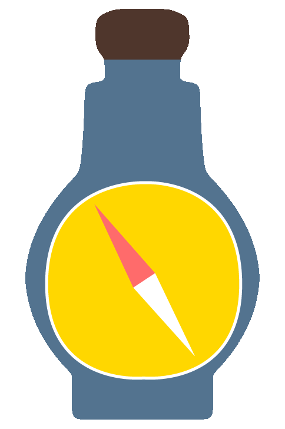

# SailorsDailyJill

    <h1 align='center'>
         
        
         
        Sailor's Daily Jill
        <h2 align='center'>Providing the navigation for daily needs.</h2>
    </h1>

 
<h1>What is Sailor's Daily Jill?</h1>
Taking inspiration from sailing terminologies, a "Jill" is a measurement of liquid, particularly used to describe rum. For, what's a sailor to do without their daily jill of rum or grog?
 
This project aims to fuilfil your daily needs with a flask-basked template that can easily dockerized and managed via kubernetes.
<h1>Installation</h1>